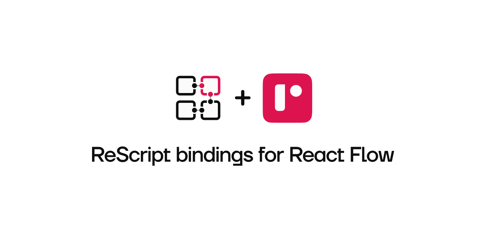

<p align="center">
  
  <br />
</p>

# ReScript React Flow

[React Flow](https://reactflow.dev/) bindings for ReScript.

## Installation

1. Install `@rescriptbr/react-flow` using npm:

```
npm install --save @rescriptbr/react-flow
```

or yarn:

```
yarn add @rescriptbr/react-flow
```

2. Add `@rescriptbr/react-flow` as dependency to your `bsconfig.json`:

```json
{
  "name": "your-project",
  "bs-dependencies": ["@rescriptbr/react-flow"]
}
```

# Examples

Check the code below for fast basic examples:

#### Creating a simple Node

```rescript
 ReactFlow.Types.Node(
    ReactFlow.Node.makeNode(
      ~id="1",
      ~position={x: 250, y: 0},
      ~data=ReactFlow.Node.toData({"label": React.string("test")}),
      ~type_="input",
      (),
    ),
  ),
```

#### Creating a simple Edge

```rescript
ReactFlow.Types.Edge(
    ReactFlow.Edge.makeEdge(
      ~id="e1-2",
      ~source="1",
      ~target="2",
      ~label="this is an edge label",
      ~data=ReactFlow.Edge.toData("some other data"),
      (),
    ),
  ),
```

#### Creating elements array

```rescript
let elements = [
  ReactFlow.Types.Edge(
    ReactFlow.Edge.makeEdge(
      ~id="e1-2",
      ~source="1",
      ~target="2",
      ~label="this is an edge label",
      ~data=ReactFlow.Edge.toData("some other data"),
      (),
    ),
  ),
  ReactFlow.Types.Node(
    ReactFlow.Node.makeNode(
      ~id="1",
      ~position={x: 250, y: 0},
      ~data=ReactFlow.Node.toData({"label": React.string("test")}),
      ~type_="input",
      (),
    ),
  ),
]
```

#### Rendering React Flow

```rescript
@react.component
let make = () => {
  let (elems, setElems) = React.useState(() => elements)
  let onElementsRemove = elementsToRemove => {
    setElems(elems => ReactFlow.Utils.removeElements(elementsToRemove, elems))
  }

  let onConnect = newEdgeParams => {
    setElems(elems => ReactFlow.Utils.addEdge(newEdgeParams, elems))
  }

  <div className="App" style={ReactDOM.Style.make(~height="800px", ~width="1200px", ())}>
    <ReactFlow
      elements={elems->ReactFlow.Utils.elementsToRaw}
      onElementsRemove
      onConnect
      onLoad
      snapToGrid=true
      snapGrid=(15, 15)>
      <ReactFlow.Controls />
      <ReactFlow.Background variant=#lines color="#aaa" gap={16} />
      <ReactFlow.MiniMap
        nodeColor={n => {
          switch ReactFlow.Node.type_Get(n) {
          | Some("input") => "#0041d0"
          | Some("output") => "#ff0072"
          | Some("default") => "#1a192b"
          | _ => "#eee"
          }
        }}
        nodeStrokeColor={_ => "#fff"}
        nodeBorderRadius={2}
      />
    </ReactFlow>
  </div>
}
```

Please look at the example folder for more advanced implementations.

## Contributing

If you'd like to contribute, you can follow the instructions below to get things working locally.

### Getting Started

1. After cloning the repo, install the dependencies

```
yarn install
```

2. Build:

```
yarn re:build
```

3. If you're running the example, in other terminal run:

```
yarn start
```
